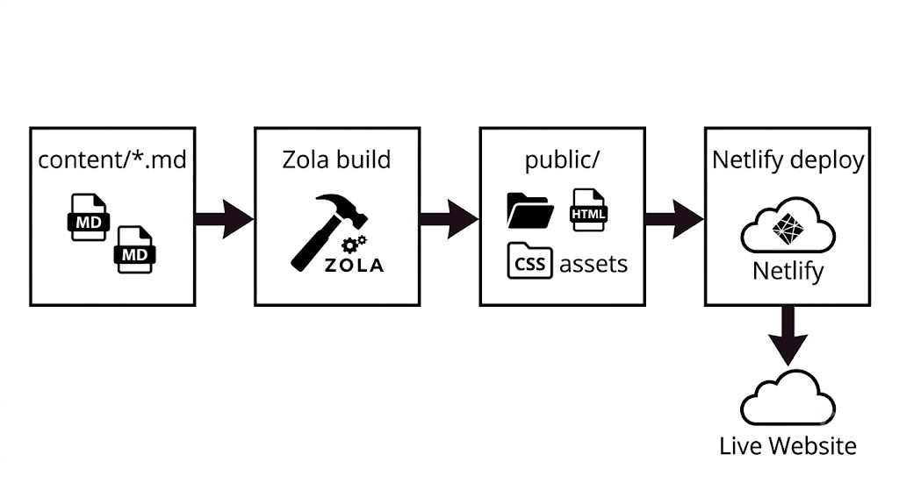

# Carolinas Regional Explorer — Project Docs

The Carolinas Regional Explorer is an open data platform for the 14-county Charlotte metropolitan region. It brings together interactive maps, a resident wellbeing survey, and data stories to help researchers, practitioners, and communities understand and act on regional trends across North and South Carolina.

---

## Docs

- [Editing content](editing.md) — updating pages, writing stories, managing events
- [Development](development.md) — adding sections, editing templates, changing styles

---

## How it works

The site's content lives in plain text files in this repository. When you save a change and upload it to GitHub, the site rebuilds and publishes itself — no manual steps needed.

- **Zola** is the tool that converts the content files into a working website. You don't interact with it directly unless you're previewing locally.
- **Netlify** is the hosting platform. It watches this repository and triggers a rebuild every time something is pushed to the `main` branch — the primary branch where final changes live.
- There is no CMS or admin panel. Editing the site means editing files.
- **Pushing to `main`** means uploading your committed changes to GitHub. See the Deploy section below.



---

## The three files you'll touch most

| Task | File |
|---|---|
| Events, footer, newsletter, embed URLs | `config.toml` |
| Page copy (home, about, collaborate) | `content/<page>/_index.md` |
| Stories | `content/stories/*.md` |

Everything else — nav links, layout, styles — lives in `templates/` and `sass/`.

---

## Where does X live?

| What | File |
|---|---|
| Site title and base URL | `config.toml` |
| Events | `config.toml` → `extra.events` |
| Footer text and email | `config.toml` → `[extra.footer]` |
| Newsletter | `config.toml` → `[extra.newsletter]` |
| Map and survey embed URLs | `config.toml` → `[extra.embeds]` |
| Home page hero, cards, about strip | `content/_index.md` |
| About page sections | `content/about/_index.md` |
| Collaborate cards and CONNECT section | `content/collaborate/_index.md` |
| Stories | `content/stories/*.md` |
| Nav links | `templates/base.html` |
| Styles | `sass/main.scss`, `sass/_nav.scss` |

---

## Preview locally

```bash
zola serve
# open http://127.0.0.1:1111
```

## Deploy

### How it works

This project uses **Git** for version control and **GitHub** as the place where the files are stored online. Netlify is connected to the GitHub repository and watches for changes.

The repository has a primary branch called `main`. A **branch** is a named version of the project — think of it as a parallel copy where you can make changes safely. `main` is the one that's live. When you push changes to `main` on GitHub, Netlify detects the update and rebuilds the site automatically within ~2 minutes.

**Pushing** means uploading your local commits (saved snapshots of changes) from your computer to GitHub.

### Publishing a change

```bash
git add .                        # stage all changed files
git commit -m "describe what you changed"   # save a snapshot
git push                         # upload to GitHub → triggers Netlify build
```

Make sure you're on the `main` branch before pushing:

```bash
git branch          # shows current branch — should say * main
git checkout main   # switch to main if you're not on it
git pull            # get the latest changes from GitHub before making your own
```

### Working on larger changes safely

If you're making several edits and want to review them before they go live, create a separate branch:

```bash
git checkout -b my-change        # create and switch to a new branch
# ... make your edits ...
git add .
git commit -m "describe changes"
git push -u origin my-change     # push the branch to GitHub
```

Then open a **pull request** on GitHub — this lets you (or a teammate) review the changes before merging into `main`. Netlify will automatically build a **preview URL** for the branch so you can see the result before it goes live.

Once reviewed, merge the pull request on GitHub and the live site updates.

### If the build fails

Netlify sends an email notification. To diagnose:

1. Open the Netlify dashboard → **Deploys**
2. Click the failed deploy to read the build log
3. The error will name the file and line causing the problem
4. Fix it locally, commit, and push again — `zola build` locally will show the same error
