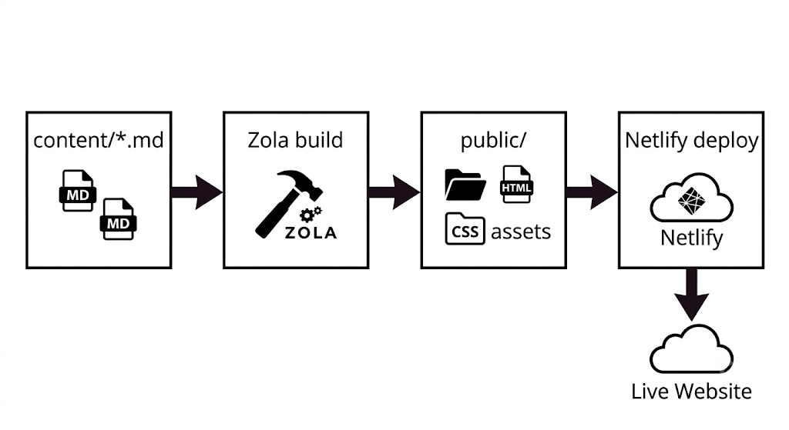

# Carolinas Regional Explorer — Project Docs

_Last updated: 2026-06-23_

The Carolinas Regional Explorer is an open data platform for the 14-county Charlotte metropolitan region. It brings together interactive maps, a resident wellbeing survey, and data stories to help researchers, practitioners, and communities understand and act on regional trends across North and South Carolina.

---

## Docs

- [Editing content](editing.md) — updating pages, writing stories, managing events
- [Development](development.md) — adding sections, editing templates, changing styles
- [Authoring a Quarto data story](quarto.md) — stories with live charts, maps, and tables
- [Deploying](deploying.md) — previewing, publishing, and fixing failed builds
- [Glossary](glossary.md) — shared terms used across these docs

---

## How it works

The site's content lives in plain text files in this repository. When you save a change and upload it to GitHub, the site rebuilds and publishes itself — no manual steps needed.

- **Zola** is the tool that converts the content files into a working website. You don't interact with it directly unless you're previewing locally.
- **Netlify** is the hosting platform. It watches this repository and triggers a rebuild every time something is pushed to the `main` branch — the primary branch where final changes live.
- There is no CMS or admin panel. Editing the site means editing files.
- **Pushing to `main`** means uploading your committed changes to GitHub. See [Deploying](deploying.md).

---

## The three files you'll touch most

| Task | File |
|---|---|
| Events, footer, newsletter, embed URLs | `config.toml` |
| Page copy (home, about, collaborate) | `content/<page>/_index.md` |
| Stories | `content/stories/*.md` |

Everything else — nav links, layout, styles — lives in `templates/` and `sass/`.

---

## Where does X live?

| What | File |
|---|---|
| Site title and base URL | `config.toml` |
| Events | `config.toml` → `extra.events` |
| Footer text and email | `config.toml` → `[extra.footer]` |
| Newsletter | `config.toml` → `[extra.newsletter]` |
| Map and survey embed URLs | `config.toml` → `[extra.embeds]` |
| Home page hero, cards, about strip | `content/_index.md` |
| About page sections | `content/about/_index.md` |
| Collaborate cards and CONNECT section | `content/collaborate/_index.md` |
| Stories | `content/stories/*.md` |
| Nav links | `templates/base.html` |
| Styles | `sass/main.scss`, `sass/_nav.scss` |

---

## Preview and deploy

Preview locally with `zola serve`, and publish by pushing to `main`. Full instructions —
previewing, publishing, pull-request previews, and fixing failed builds — are in
[Deploying](deploying.md).
