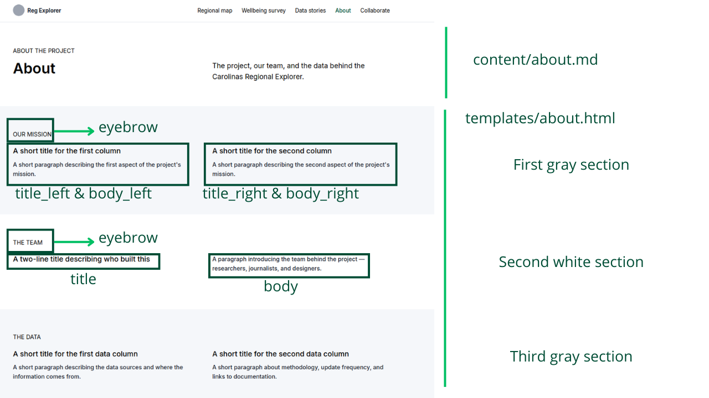

# Editing Content

---

## Writing a story

Create `content/stories/your-story-slug.md`:

```toml
+++
title       = "Story title"
date        = 2025-09-01
description = "One sentence summarising the main finding."
template    = "story_page.html"
tags        = ["housing"]

[extra]
author    = "First Last"
read_time = "4 min read"
+++

Opening paragraph.

## Section heading

More content here.
```

The story is live once the file is committed and the site rebuilds.

### Tags

Tags are defined with the `tags` field at the top of the front matter (outside `[extra]`). They must be **lowercase**.

```toml
tags = ["housing"]
tags = ["housing", "economy"]   # a story can have multiple tags
```

Tags power the filter buttons on the Stories page — a new tag appears automatically the first time it's used in any story. There is no list to maintain separately.

Existing tags: `infrastructure`, `economy`, `education`, `housing`, `healthcare`

### Adding images to a story

Place image files in `static/imgs/stories/`. In the story body:

```markdown

```

For a caption, paste raw HTML directly in the Markdown file — Zola renders it as-is:

```html
<figure>
  
  <figcaption>Caption text.</figcaption>
</figure>
```

---

## Home page

File: `content/_index.md`

### Hero

```toml
[extra]
hero_title     = "Main headline"
hero_desc      = "Supporting sentence below the headline."
hero_img       = "/imgs/your-image.jpg"
hero_img_label = "Caption shown under the image"
```

Place image files in `static/imgs/`.

### Section cards (Map, Survey, Stories)

```toml
sections = [
  { title = "Regional Map", slug = "map", description = "...", button = "Explore the map" },
  { title = "Wellbeing Survey", slug = "survey", description = "...", button = "See the results" },
  { title = "Data Stories", slug = "stories", description = "...", button = "Read stories" }
]
```

Do not change `slug` — it must match the folder name under `content/`.

### About strip

```toml
[extra.section_about]
eyebrow    = "About the project"
title      = "Who are we and why we built this?"
body       = "Short paragraph about the team."
link_label = "More about the project"
link       = "/about/"
```

---

## About page

File: `content/about/_index.md`

### Hero

```toml
title       = "Page headline (large H1)"
description = "Subtitle shown below the headline."

[extra]
hero_eyebrow = "Small label above the title"
```

### Three sections

Each section is an object in `[extra]`:

```toml
[extra.sectionA]          # first gray section (two columns)
eyebrow     = "Our mission"
title_left  = "Left column title"
body_left   = "Left column body."
title_right = "Right column title"
body_right  = "Right column body."

[extra.sectionB]          # white section (title left, text right)
eyebrow = "The team"
title   = "Title on the left"
body    = "Body on the right."

[extra.sectionC]          # second gray section (two columns)
eyebrow     = "The data"
title_left  = "Left column title"
body_left   = "Left column body."
title_right = "Right column title"
body_right  = "Right column body."
```



---

## Collaborate page

File: `content/collaborate/_index.md`

### Hero

```toml
title       = "Page headline"
description = "Subtitle shown below the headline."

[extra]
hero_eyebrow = "Small label above the title"
hero_cta     = "A short line with an <a href=\"mailto:you@domain.com\">email link</a>"
```

### Cards

Add, edit, or remove `[[extra.cards]]` blocks:

```toml
[[extra.cards]]
title = "Card title"
desc  = "Card description."
```

### CONNECT section (left column of events area)

```toml
[extra.connect]
eyebrow = "CONNECT"
title   = "Section title"
body    = "<p>First paragraph.</p><p>Second paragraph.</p>"
```

`body` accepts HTML — use `<p>` tags for multiple paragraphs.

### Events

Managed site-wide — see [Events](#events) below.

---

## Events

File: `config.toml` → `extra.events`

```toml
[extra]
events = [
  { title = "Event name", date = "July 10, 2026", description = "Short description.", link = "https://...", link_label = "Register" },
  { title = "Another event", date = "August 5, 2026", description = "Short description." },
]
```

- Omit `link` and `link_label` to hide the link for an event.
- Events appear in the order listed.
- Changes here affect the Collaborate page automatically.

---

## Footer

File: `config.toml` → `[extra.footer]`

```toml
[extra.footer]
tagline_1    = "Short mission line shown under the logo."
tagline_2    = "Second line with context."
email        = "hello@example.com"
address      = "Physical address or location."
hours        = "Office hours or response time."
copyright    = "2026 Carolinas Regional Explorer"
credit_text  = "Built by"
credit_link  = "/about/"
credit_label = "the project team"
```

Changes here apply to the footer on every page.

---

## Newsletter

File: `config.toml` → `[extra.newsletter]`

```toml
[extra.newsletter]
eyebrow = "Stay in the loop"
title   = "Join the newsletter"
button  = "Subscribe"
```

---

## Map and survey embeds

The Regional Map and Wellbeing Survey pages each embed an external application via an `<iframe>`. The URLs are set in `config.toml`:

```toml
[extra.embeds]
map    = "https://ui-map-pablitx.netlify.app/?embed=true"
survey = "https://charlotte-regional-survey-dashboard.streamlit.app/?embed=true"
```

To point to a different app, replace the URL value. The `?embed=true` parameter is required by both apps — keep it when updating the URL unless the new app uses a different parameter.
