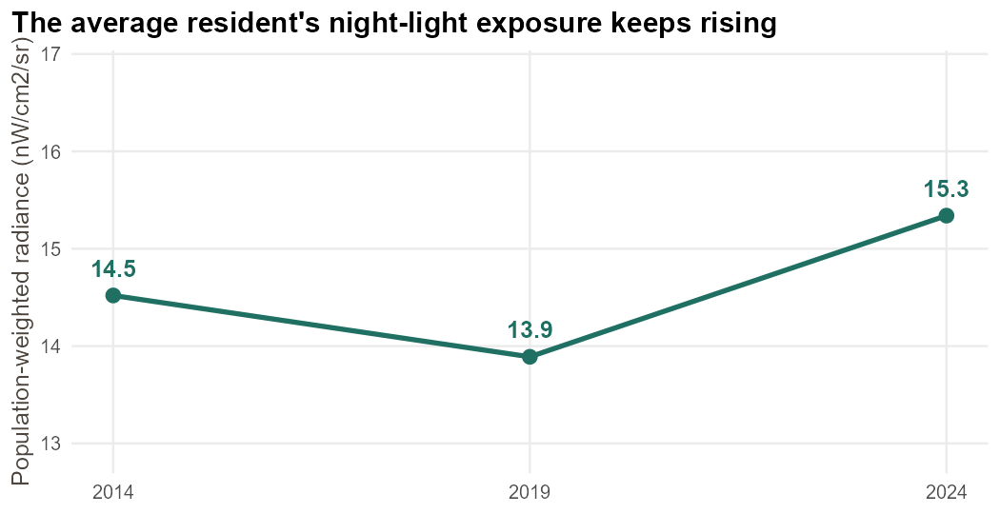
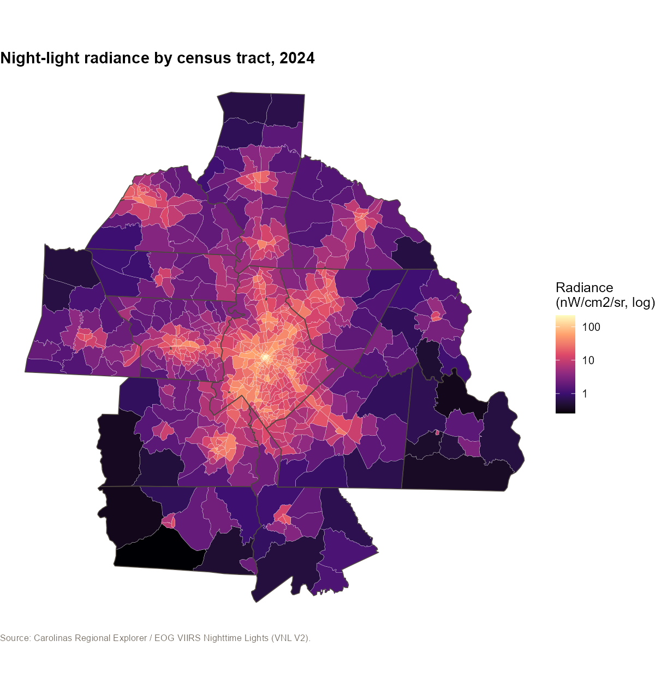
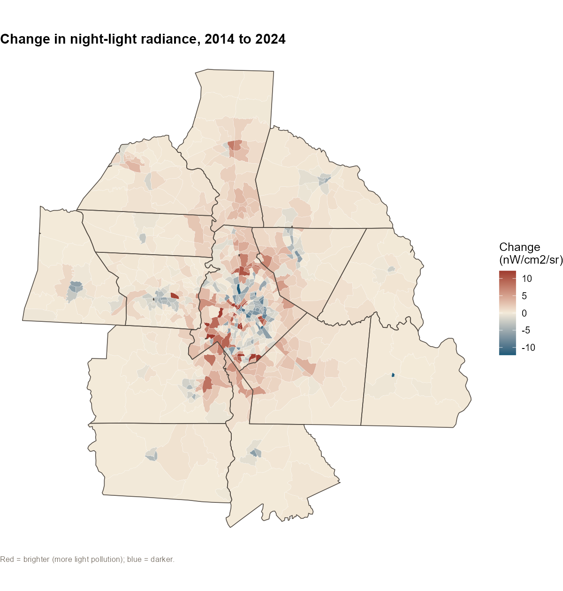
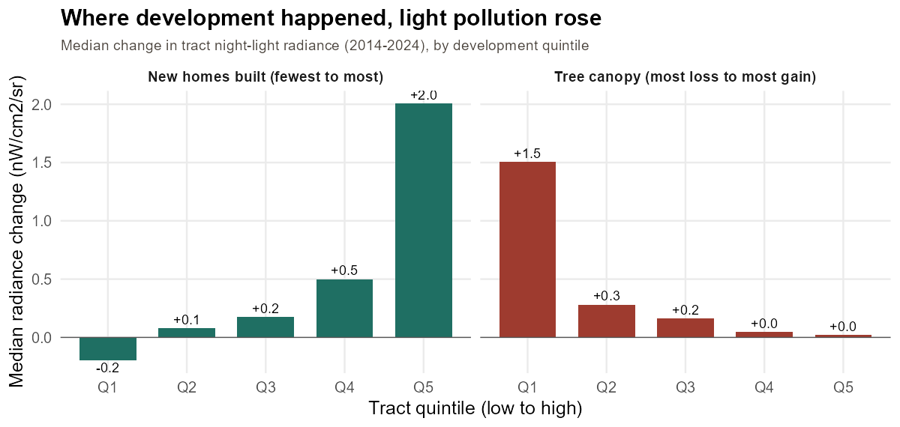
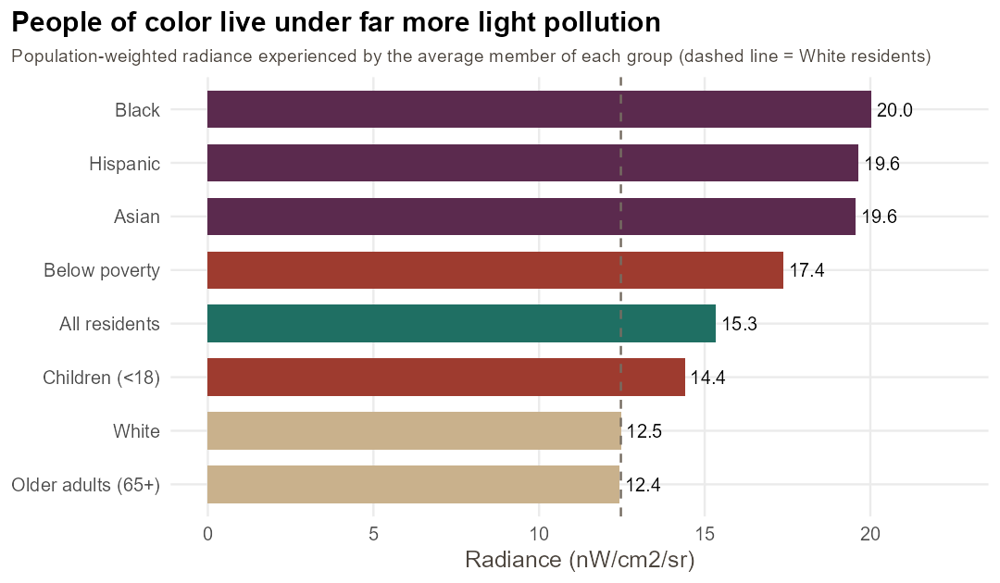
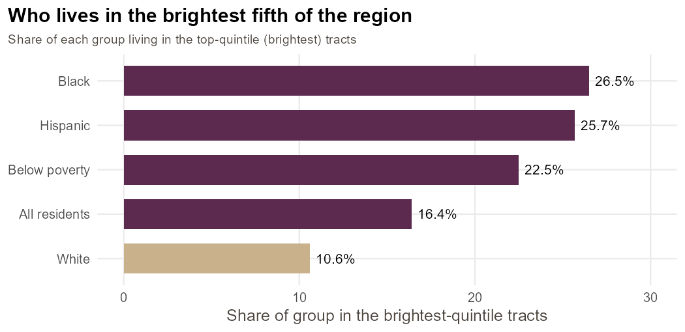
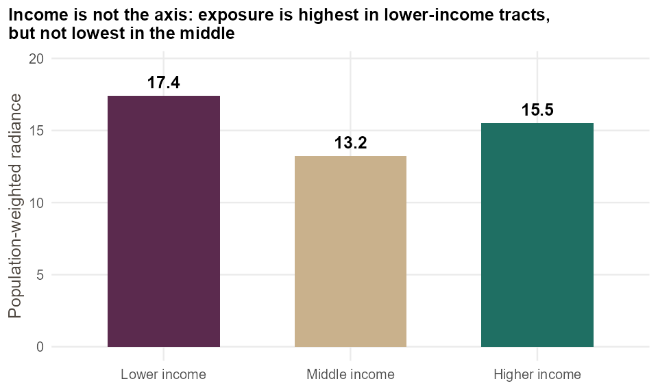

::: {.lead}
Stand in the center of Charlotte on a clear night and look up. You will see the Moon, a few bright planets,
perhaps a dozen stars. What you will not see is the Milky Way, the band of our own galaxy that every human
generation before the last few could take for granted. It has not moved. We have drowned it in
artificial light. Light pollution is one of the most widespread environmental changes of the modern era and
one of the least discussed. Using the Carolinas Regional Explorer's satellite night-lights data, this story
asks three questions: how bright are the region's nights and where are they brightening fastest, what does
that light cost, and who carries the burden.
:::

## The short version

- The average resident's exposure to artificial light at night **rose about 6% between 2014 and 2024**
  (population-weighted radiance 14.5 → 15.3), and roughly **two-thirds of tracts got brighter**. Satellite
  sensors almost certainly *understate* the real trend [@kyba2023].
- The light is wildly uneven across space: the brightest tract (Uptown Charlotte) is about **850 times
  brighter** than the darkest rural one, and the fastest brightening is in **Uptown and South End
  redevelopment** and the same fast-growing southern suburbs that are also losing tree canopy.
- Charlotte is not unusual. More than **99% of Americans live under light-polluted skies**, and about
  **80% cannot see the Milky Way** from home [@falchi2016]. That has measurable costs for sleep and health
  [@ama2016; @chepesiuk2009] and for wildlife [@longcore2004].
- The burden is **not equally shared**. People of color in the region experience about **60% more**
  night-light than white residents, and Black residents are **more than twice as likely** to live in the
  brightest fifth of the region. Here the axis of inequity is **race and urban density, not income**, which mirrors the first national environmental-justice study of light pollution [@nadybal2020].

## A pollutant hiding in plain sight

Most pollution announces itself: smog you can smell, water you would not drink. Light pollution is different.
It is the one pollutant we deliberately manufacture and often admire. Yet artificial light at night (ALAN)
has grown into a genuine environmental force. Ground-based measurements from tens of thousands of citizen
scientists found the night sky **brightening about 10% per year across North America** from 2011 to 2022,
fast enough to double in under a decade [@kyba2023]. A child born where 250 stars are visible would see
barely 100 by adulthood. Satellites record a gentler rise of roughly 2% per year, but that is largely
because their sensors are blind to the blue-rich light of modern white LEDs, which scatters most in the
atmosphere. The satellite view, including the data in this story, is a **conservative** one.

Why does it matter beyond stargazing?

- **Human health.** Light at night suppresses melatonin and disrupts the circadian clock that governs sleep,
  metabolism, and mood. Blue-rich LED light suppresses melatonin roughly twice as long as warmer light and
  can shift the body clock by hours [@ama2016]. The American Medical Association has formally warned about
  the health effects of nighttime lighting, and reviews link chronic circadian disruption to sleep loss and
  elevated risks for several diseases [@chepesiuk2009; @ama2016].
- **Wildlife and ecology.** "Ecological light pollution" reshapes the nights that half of all animal species
  depend on [@longcore2004]. Artificial light disorients migrating birds, drawing them into lit skylines and
  toward fatal collisions; it traps and exhausts nocturnal insects already in steep decline, with knock-on
  effects for pollination and food webs; it disrupts amphibians, bats, and firefly courtship.
- **Energy and cost.** Light that shines sideways or up is light doing no useful work. Poorly aimed outdoor
  lighting wastes energy and money and adds carbon for no benefit.
- **A shared inheritance.** A dark, star-filled sky is a cultural and scientific commons. Its loss is
  effectively total for city dwellers: more than one-third of humanity, and four in five North Americans,
  can no longer see the Milky Way [@falchi2016].

## How to read the metric

The Explorer measures light pollution as **upward radiance** captured by the VIIRS satellite sensor, in
nanowatts per square centimeter per steradian (nW/cm²/sr), averaged over each census tract [@elvidge2021].
Higher means more artificial light escaping to the sky. It is a satellite measurement, not a survey, so it
carries no sampling error, but two caveats matter. First, upward radiance is a **proxy** for the skyglow a
person experiences on the ground, not a direct measure of it; the world atlas that translates satellite
radiance into human sky brightness required a radiative-transfer model calibrated against tens of thousands
of ground observations [@falchi2016]. Second, as noted, VIIRS is relatively **blind to blue light**, so it
understates the brightening from the LED transition [@kyba2023]. Read the numbers here as a floor, and as a
strong indicator of *where* light concentrates and *how* it is changing.

To anchor the scale: the region's darkest rural tracts sit near **1** nW/cm²/sr (a reasonably dark sky where
the Milky Way is faintly visible); the dense urban core exceeds **130** and peaks around **220** (an
inner-city sky where only the brightest stars survive and the Milky Way is long gone).

## 1. How bright, and getting brighter

The region's nights are brightening. Weighted by where people actually live, average radiance rose from
**14.5 in 2014 to 15.3 in 2024**, about **6%**, after a dip in 2019 (@fig-trend). The median tract climbed
from 10.7 to 12.0, and **63% of all tracts** were brighter in 2024 than a decade earlier.

{#fig-trend width=78%}

The regional average conceals an enormous spatial range. @fig-radiance maps radiance on a logarithmic
scale, and the result looks like the satellite night-lights image it is: a blazing core over Uptown
Charlotte and the dense Mecklenburg ring, fading through the suburbs to near-darkness at the rural edge.
The brightest tract is roughly **850 times** brighter than the darkest.

{#fig-radiance width=92%}

Where has it grown fastest? @fig-change maps the decade's change. The strongest gains cluster in the
redeveloping center city and the growing southern suburbs; the faint dimming at the rural edges is small in
absolute terms.

{#fig-change width=92%}

The brightest places are the **Uptown wards** (Table 1), where radiance runs from 130 to
220. More striking is *where the light grew fastest*. The same Uptown and Gateway tracts that top the
brightness list also **rose the most**, by 50 to 80 units in a decade, as the center city's building boom
lit up. Just behind them sits **Providence / Blakeney**, one of the fast-growing southern suburbs that our
companion story found losing tree canopy to new subdivisions. Development brings both more rooftops and more
light.

| Tract (neighborhood) | Radiance 2014 | Radiance 2024 | Change |
|---|---:|---:|---:|
| Fourth Ward / Gateway / Uptown | 140 | **220** | +80 |
| Third Ward / Uptown | 146 | 220 | +74 |
| First Ward / Uptown | 162 | 213 | +51 |
| Second Ward / Uptown | 139 | 167 | +29 |
| Fourth Ward / First Ward | 116 | 130 | +14 |
| Providence / Blakeney (suburban) | 8 | 28 | +21 |

: The brightest tracts and largest increases, 2014–2024 (nW/cm²/sr). {#tbl-bright}

By county (@tbl-county), **Mecklenburg** is in a class of its own at 26.6, more than twice any other county,
followed by the suburban ring (Cabarrus, York). The rural counties remain comparatively dark. Almost every
populated county brightened over the decade; the few that dimmed are small, rural, and lightly populated.

| County | Radiance 2014 | Radiance 2024 | Change |
|---|---:|---:|---:|
| Mecklenburg | 25.5 | **26.6** | +1.1 |
| Cabarrus | 11.3 | 11.9 | +0.6 |
| York (SC) | 10.2 | 11.6 | +1.4 |
| Gaston | 10.9 | 10.6 | −0.3 |
| Iredell | 6.8 | 8.4 | +1.6 |
| Union | 6.7 | 8.3 | +1.6 |
| Anson (rural) | 5.3 | 1.6 | −3.7 |

: Population-weighted radiance by selected county, 2014–2024. {#tbl-county}

## What is driving it: development

Why are the region's nights brightening, and so unevenly? The pattern points to **development**:
the same construction that adds rooftops, roads, and parking lots also adds light. Two development
signatures stand out (@fig-development).

**New housing.** Tracts that built the most new homes over the decade saw the largest light-pollution
increases. The top fifth by new-home construction gained a median of about **+2 nW/cm²/sr**, while the
tracts that built the least were flat or slightly darker. Light tracks the building boom.

**Tree-canopy loss.** The same relationship appears in reverse for trees. Tracts that lost the most
canopy gained the most light (a median of about **+1.5**), while tracts whose canopy held steady or grew
saw essentially no change. Clearing land for development removes the tree cover that once darkened the
night and installs the lighting that replaces it, the twin signatures of the same growth, and a direct
link to the region's documented canopy loss.

{#fig-development width=95%}

These are **preliminary, descriptive** findings from ongoing analysis for a forthcoming working paper,
which models the drivers of light-pollution change more formally, accounting for baseline brightness,
income, neighborhood composition, employment density, and spatial structure. That fuller analysis will be
released as a companion academic paper and referenced here; the association above is the headline it is
built on.

## 2. What the light costs

Put the region's 3.1 million residents on the brightness ladder and the exposure is
broad. About **half of all residents (47%) live in a tract brighter than the regional median**, and roughly
**508,000 people live in the brightest fifth** of tracts, where the median tract sits near 37, effectively an
inner-suburban to urban sky in which the Milky Way is invisible. Only the darkest quintile, about 608,000
mostly rural and exurban residents, enjoys anything close to a natural night.

This is where the regional numbers meet the global literature. The Charlotte region is a normal American
metro, and normal American metros sit almost entirely under light-polluted skies [@falchi2016]. For the
hundreds of thousands of residents in its bright core, that means the documented downsides are not abstract:
disrupted sleep and circadian rhythm [@ama2016; @chepesiuk2009], and an urban ecology in which migrating
birds, insects, and other nocturnal wildlife contend with a night that never fully arrives [@longcore2004].
It also means the region carries a slow, compounding loss most people never notice, because the dark that is
missing cannot be seen.

There is a quiet paradox here. Light at night is a byproduct of exactly the growth the region celebrates:
the cranes over South End, the subdivisions pushing south. The same places gaining people, buildings, and
economic energy are the places losing their nights, and often their trees along with them.

## 3. An unequal night

Light pollution, it turns out, is not distributed the way you might guess. Nationally, the first
environmental-justice study of ALAN found that Black, Hispanic, and Asian residents, and lower-income
communities, live in significantly brighter areas than white and higher-income residents [@nadybal2020]. The
Charlotte region fits that pattern on race, sharply.

Weighting each group by where its members live (@fig-equity), the **average Black resident is
exposed to radiance of 20.0, versus 12.5 for the average white resident, about 60% more.** Hispanic (19.7)
and Asian (19.6) residents are close behind, and residents below the poverty line (17.4) are also more
exposed. The gap widens at the top of the scale: **26.5% of Black residents and 25.7% of Hispanic residents
live in the brightest fifth of the region, compared with 10.6% of white residents** (@fig-bright).

{#fig-equity width=85%}

{#fig-bright width=80%}

But the axis of inequity here is **race and urban density, not income** in the simple sense. Radiance
correlates strongly with the share of people of color in a tract (Spearman ρ = 0.54) and even more strongly
with population density (ρ = 0.82), yet barely at all with median income (ρ = −0.03). Sorted into income
thirds (@fig-income), exposure is highest in lower-income tracts but is *not* lowest in the middle: it rises
again in the highest-income group, lifted by the bright, affluent core of Uptown and South End. The
mechanism is spatial. Artificial light concentrates in the dense urban core and its commercial and
industrial corridors, and in this region, as in most, people of color are disproportionately housed there.
Density lights the sky; segregation decides who lives beneath it.

{#fig-income width=70%}

There is a greener dimension to the inequity, and it ties directly to the region's development. Sort
residents by the tree canopy of their neighborhood and the gap is stark: **those in the least-green tracts
are exposed to about 2.5 times more light at night than those in the leafiest ones** (a population-weighted
23.0 versus 9.0 nW/cm²/sr). Nearly a million people live in low-canopy neighborhoods under the brightest
nights, while a comparable million in high-canopy neighborhoods keep the darkest. Tree cover and darkness go
together, and their absence compounds: the same neighborhoods clearing canopy for development are gaining the
most light, so the loss of shade by day and the loss of dark by night fall on the same residents.

The equity finding is therefore both real and specific. It is not that poor neighborhoods are singled out
for floodlights. It is that the region's brightest ground, its urban core and industrial edges, is
disproportionately home to Black, Hispanic, and Asian residents, so the health and ecological costs of the
night sky's loss fall first on them.

## Bending the curve

Light pollution is unusual among environmental problems in that the remedy is cheap, fast, and reversible.
Unlike carbon already in the atmosphere, skyglow disappears the instant a light is shielded, dimmed, or
switched off. DarkSky International's widely adopted **Five Principles for Responsible Outdoor Lighting** are
the template [@darksky_principles]:

1. **Useful**: light only where there is a clear need.
2. **Targeted**: direct light down, to the ground, with full shielding. Full shielding alone can cut
   skyglow by 50% to more than 90% [@darksky_principles].
3. **Low level**: no brighter than necessary.
4. **Controlled**: use timers, dimmers, and curfews so light is on only when useful.
5. **Warm-colored**: cap correlated color temperature at **3000 K or lower** (2200–2700 K where possible) to
   limit the blue light that most affects health, wildlife, and skyglow, a threshold the AMA also endorses
   [@ama2016].

Cities have shown it works. **Flagstaff, Arizona**, the world's first International Dark Sky City, has held
its skyglow nearly flat for decades through shielding standards, amber lighting, and caps on total light per
acre, even as it grew [@darksky_places]. **Tucson** converted its street lighting to shielded, dimmable LEDs
and measurably *reduced* its skyglow. **Pittsburgh** and **Fort Collins** have adopted dark-sky ordinances
for public lighting. None of these are dark rural outposts; they are functioning cities that decided their
nights were worth protecting [@darksky_places].

For a fast-growing region like Charlotte, the priorities are clear: adopt a modern outdoor-lighting
ordinance for new development and public projects (full shielding, 3000 K caps, curfew-dimming); specify
warm, shielded, dimmable fixtures in the region's ongoing LED streetlight conversions rather than the harsh
blue-white default; and treat lighting as part of the same growth-management conversation that governs tree
canopy and stormwater. The cheapest way to keep the nights is to build the next decade's lights correctly
the first time.

## What it means

The Charlotte region's nights are getting brighter, unevenly, and the trend is likely stronger than the
satellites can see. The costs, to sleep and health, to wildlife, and to a shared night sky, are real if
easy to ignore, and they land first on the region's Black, Hispanic, and Asian residents, who are
concentrated where the ground glows most. None of this is inevitable. Light pollution is the rare
environmental harm that can be undone almost overnight, one shielded, warmer, well-aimed fixture at a time.
The dark is not gone. It is only switched on.

## Data and methods {#data-and-methods}

**Light pollution.** Area-weighted mean upward radiance per census tract (nW/cm²/sr) from the Earth
Observation Group's **VIIRS annual nighttime-lights composites (VNL V2)** for 2014, 2019, and 2024, as
compiled in the Carolinas Regional Explorer [@elvidge2021]. VIIRS measures light escaping to the satellite,
a proxy for, not a direct measure of, ground-level sky brightness, and it is relatively insensitive to
blue-wavelength light, so it likely understates recent brightening [@kyba2023; @falchi2016]. It is a
satellite measurement and carries no sampling margin of error.

**Population weighting.** Regional and group averages are **population-weighted**: each tract's radiance is
weighted by the population (or group population) living in it, so the figures describe the light the average
*person* experiences, not the average acre. Group populations are tract population multiplied by each group's
share (race/ethnicity, poverty, age) from the American Community Survey via the Explorer. This is the
standard approach in distributive environmental-justice analysis [@nadybal2020].

**Equity analysis.** "People of color" is the non-white share of population. Group exposure is the
population-weighted mean radiance for that group across all 752 tracts; "brightest quintile" tracts are the
top 20% by 2024 radiance. Correlations are Spearman rank coefficients (descriptive, not causal). Income
thirds are tertiles of tract median household income.

**Reproducibility.** All processing and figures were produced in **R** (`analyze.R`, `figs.R`) from the
Explorer's public data contract; the tract-level table and county/equity summaries are in this story's
`data/` folder. Explore the underlying **Light pollution (night lights)** indicator, alongside income,
race, and density, for any tract in the Carolinas Regional Explorer.

## References

::: {#refs}
:::
