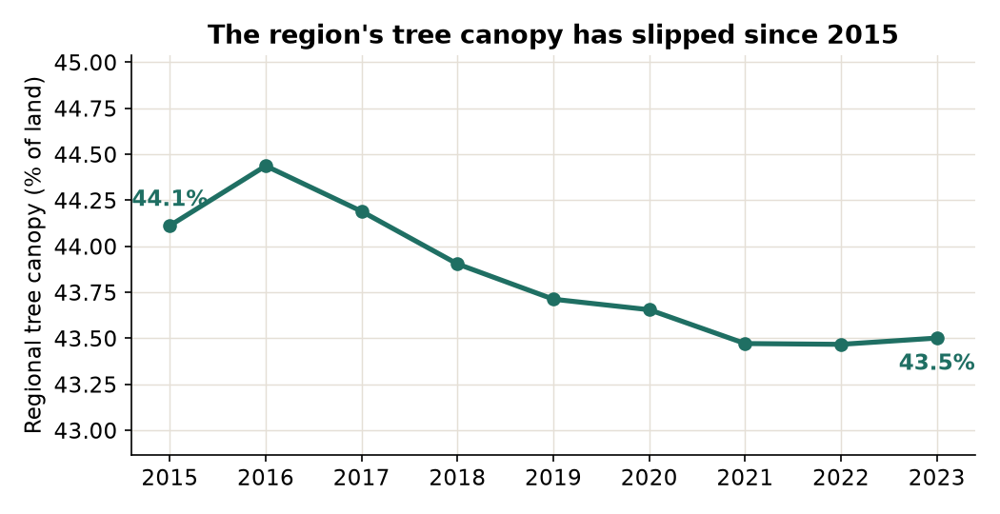
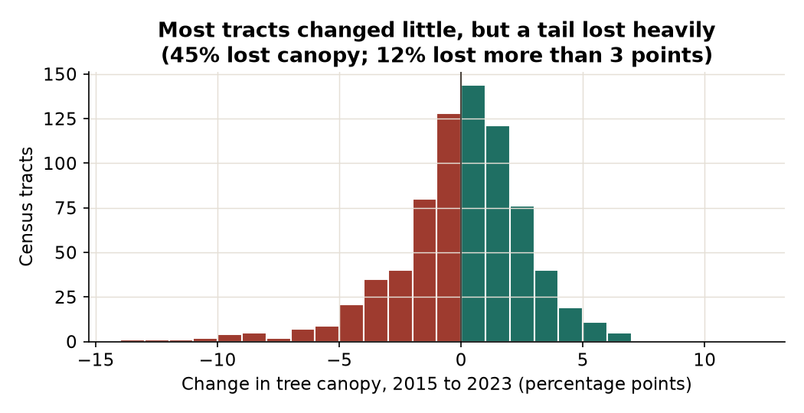
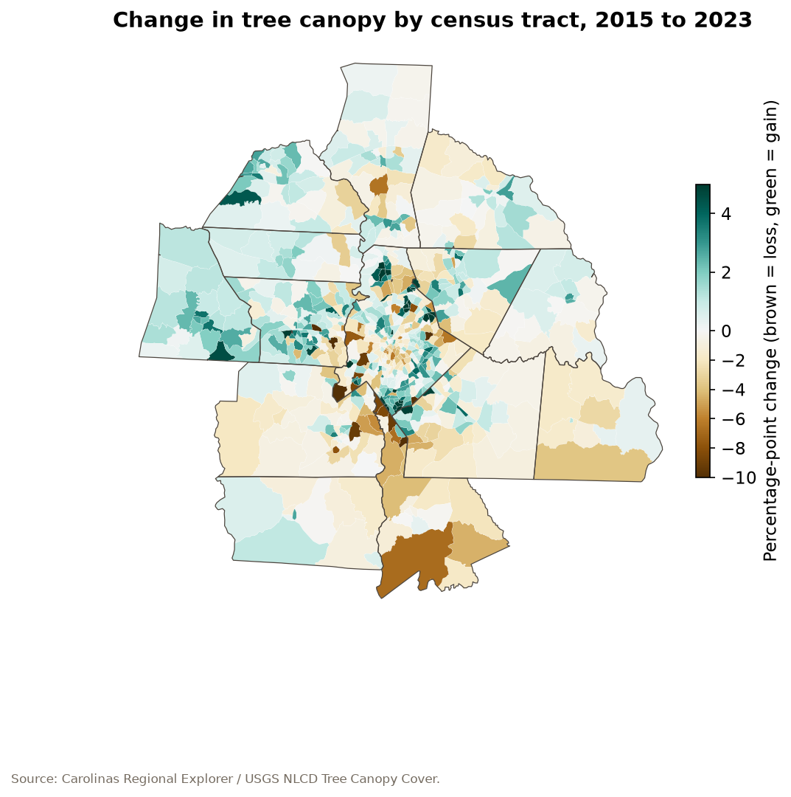
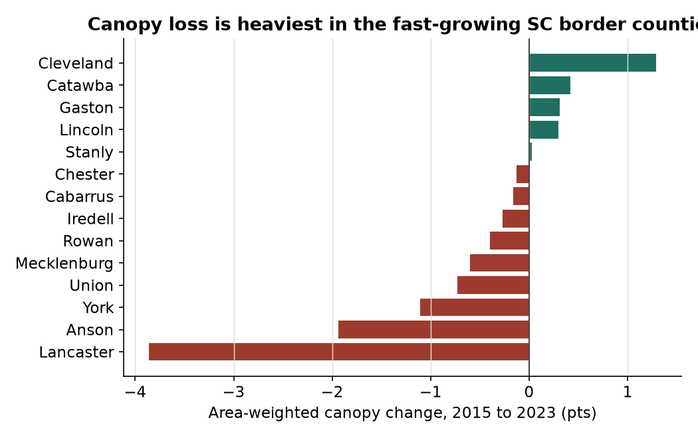
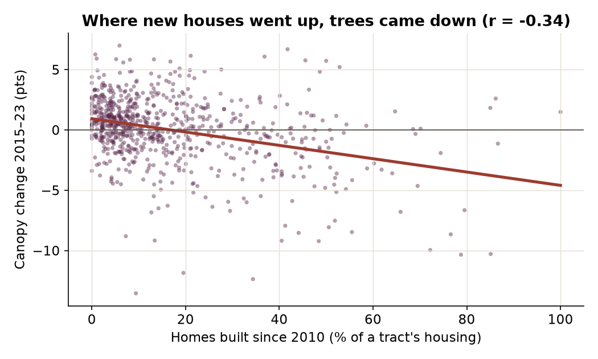
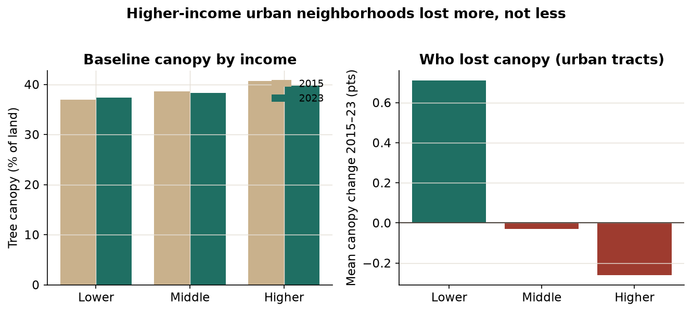

::: {.lead}
Charlotte likes to call itself a city of trees. Drive its older streets and the claim is easy to
believe: a high, closed canopy arches over the pavement. But the tree cover that gives the region its
character is thinning, and it is thinning fastest in the places that are growing fastest. Using
tract-level tree-canopy data from the [Carolinas Regional Explorer](https://github.com/kvenkita/crxp), this story asks three questions: where is the canopy changing, what is driving it, and who is
losing the most.
:::

## The short version

- Across the 14-county region, tree canopy slipped from about **44.1% of land in 2015 to 43.5% in 2023**,
  a loss of **0.6 percentage points**, or roughly **1.4%** of the region's tree cover in eight years.
- The regional average hides a sharp tail. **Nearly half of tracts (45%) lost canopy, and about 1 in 8
  (12%) lost more than three percentage points.** A handful lost more than ten.
- Losses concentrate in **fast-growing exurban tracts**, especially in the South Carolina border counties
  (Lancaster, York) and the southern edge of Mecklenburg. Where new subdivisions went up, trees came down.
- The relationship with wealth runs opposite to the national pattern. Nationally, lower-income
  neighborhoods have *less* canopy [@mcdonald2021]. Here, in the region's urban clusters, **higher-income
  neighborhoods lost *more* canopy over this period, not less**, because the loss tracks new
  construction, and new construction concentrates in affluent, growing areas.

::: {.callout-note}
These figures come from the **NLCD Tree Canopy Cover** satellite product [@nlcd_tcc], which sees the whole
14-county region, including its forested rural fringe. They are not the same as the City of Charlotte's
parcel-level canopy studies, which cover the city alone and report a higher number. Both point the same direction: down. See [Data and methods] for the distinction.
:::

## 1. A region still green, but thinning

At 44% tree cover, the Charlotte region is leafy, well above most U.S. metros. But the trend
line bends the wrong way. Between 2015 and 2023 the region's canopy trended steadily downward, settling
about half a point lower (@fig-trend).

{#fig-trend fig-scap="The y-axis is zoomed in to show the trend clearly — the visible dip is a real half-point decline across a 44%-canopy region." fig-alt="Line chart of regional tree canopy percentage from 2015 to 2023, showing a peak in 2016 followed by a steady decline to 43.5 percent by 2023." width=80%}

Half a point sounds trivial. It is not, for two reasons. First, a regional average pools rapidly
developing areas with vast tracts of protected or rural forest that change little, so it dilutes real
local losses. Second, the losses are lumpy. @fig-change shows the distribution of change across the
region's 752 tracts: most changed little, but a long left tail of tracts shed canopy heavily.

{#fig-change fig-scap="Watch the left tail, not just the peak: most tracts sit near zero, but a long tail of heavy losers pulls the regional average down." fig-alt="Histogram of canopy change across the region's 752 census tracts, showing most tracts clustered near zero change with a long left tail of tracts that lost significant canopy." width=80%}

This matches, at a regional scale, what the City of Charlotte's own high-resolution assessments have been
warning for years: the city's canopy fell from **49% to 45% between 2012 and 2018**, a net loss of some
250,000 trees, and continued sliding to about 47% by 2023 [@charlotte_canopy_2019; @charlotte_canopy_2023;
@ui_canopy]. Our regional data extends that story outward from the city line to the exurban counties where
the region's growth is now happening.

## 2. Where the losses land

Canopy change is not evenly spread. @fig-map maps it tract by tract. The brown (canopy loss) clusters along the region's growth frontier: the southern arc of Mecklenburg into Union, and across the
state line into the booming Lancaster and York county suburbs.

{#fig-map fig-scap="Darker brown marks the steepest losses — trace the growth frontier along southern Mecklenburg and across into Lancaster and York." fig-alt="Map of the 14-county region colored by tract-level canopy change, with brown areas showing canopy loss concentrated along the southern growth frontier of Mecklenburg County into Union County and across the state line into Lancaster and York counties, South Carolina." width=95%}

By county, the pattern is unambiguous (@fig-county). The heaviest losses are in the **South Carolina
border counties**, Lancaster lost nearly **4 points** of canopy and York more than a point, exactly the
places absorbing Charlotte's southward spillover. The slower-growing western counties (Cleveland, Gaston,
Catawba) *gained* canopy as existing trees matured.

{#fig-county fig-scap="Bars are sorted by change: South Carolina border counties cluster at the losing end, slower-growing western counties at the gaining end." fig-alt="Bar chart of area-weighted canopy change by county from 2015 to 2023, ranging from a loss of 3.9 percentage points in Lancaster County to a gain of 1.3 points in Cleveland County, with South Carolina border counties showing the steepest losses." width=80%}

| County | Canopy 2015 | Canopy 2023 | Change (pts) |
|---|---:|---:|---:|
| Lancaster (SC) | 57.1% | 53.3% | **−3.9** |
| Anson (NC) | 57.3% | 55.3% | −1.9 |
| York (SC) | 50.0% | 48.9% | −1.1 |
| Union (NC) | 31.1% | 30.4% | −0.7 |
| Mecklenburg (NC) | 40.4% | 39.8% | −0.6 |
| Rowan (NC) | 39.0% | 38.6% | −0.4 |
| Iredell (NC) | 37.0% | 36.8% | −0.3 |
| Cabarrus (NC) | 39.9% | 39.7% | −0.2 |
| Chester (SC) | 61.6% | 61.5% | −0.1 |
| Stanly (NC) | 37.9% | 37.9% | +0.0 |
| Lincoln (NC) | 38.6% | 38.9% | +0.3 |
| Gaston (NC) | 45.6% | 45.9% | +0.3 |
| Catawba (NC) | 35.7% | 36.1% | +0.4 |
| Cleveland (NC) | 37.7% | 39.0% | **+1.3** |

: Tree canopy by county, area-weighted, 2015–2023. {#tbl-county}

Zoom to the tract level and the losses have names. The ten hardest-hit tracts (@tbl-losers) read like a
map of the region's construction boom: **Providence / Blakeney** in south Charlotte (78% of its homes
built since 2010), **Walnut Creek / Bent Creek** in Lancaster (85% new), **The Sanctuary** on Lake
Wylie, and **Steele Creek**, the same southwest Charlotte area the city's studies flag as
critically low and heavily developed [@charlotte_canopy_2019].

| Tract (neighborhood) | County | Canopy 2015 | Canopy 2023 | Change | Homes built since 2010 |
|---|---|---:|---:|---:|---:|
| Westside area | Gaston | 38.2% | 24.7% | **−13.6** | 9% |
| Embassy East / Reedy Creek | Mecklenburg | 62.0% | 49.6% | −12.4 | 34% |
| Lakewood area | Gaston | 57.5% | 45.6% | −11.9 | 20% |
| Providence / Blakeney | Mecklenburg | 60.1% | 49.7% | −10.4 | 79% |
| Walnut Creek / Bent Creek | Lancaster | 45.5% | 35.2% | −10.3 | 85% |
| The Sanctuary / North Rock Hill | Mecklenburg | 48.9% | 39.0% | −10.0 | 72% |
| East Rock Hill / Seven Oaks | York | 35.6% | 26.4% | −9.2 | 48% |
| Fox Ridge / Avondale | Lancaster | 49.8% | 40.6% | −9.2 | 41% |
| Shopton / City Park | Mecklenburg | 55.5% | 46.3% | −9.2 | 13% |
| Steele Creek / Ayrsley | Mecklenburg | 26.8% | 18.0% | −8.8 | 7% |

: The ten census tracts that lost the most canopy, 2015–2023. {#tbl-losers}

## 3. Follow the bulldozers

The single strongest correlate of canopy loss in the data is not income, or race, or geography. It is
**development**. Where the share of recently built homes is high, canopy change is negative (@fig-housing);
the correlation is **r = −0.34**. The relationship is even tighter against physical development: canopy
change correlates **−0.50** with the growth of impervious surface (roads, roofs, parking), the clearest
signature of land being cleared and paved.

{#fig-housing fig-scap="Each point is a census tract; the downward slope is the correlation — more recent construction tracks with more canopy loss." fig-alt="Scatter plot of tract-level canopy change against the share of homes built since 2010, showing a negative trend (r = -0.34): tracts with more recent construction lost more canopy." width=80%}

The gradient is stark. Tracts in the **top quarter** for recent construction lost **1.3 points** of
canopy on average; tracts in the **bottom quarter** *gained* **0.9 points**. In slower-growing,
built-out neighborhoods, existing trees kept growing; several dense Mecklenburg tracts gained six
or seven points as their canopy matured. The region is running a race between two processes: mature trees
filling in on one side, and forest cleared for subdivisions on the other. Since 2015, clearing has been
winning.

## 4. The income twist

Here is where the Charlotte region complicates the national story. The most cited fact in urban forestry
is that trees are unequally distributed by wealth: across 5,723 U.S. communities, lower-income blocks
average **15% less tree cover** and run about **1.5°C hotter** in summer than higher-income blocks
[@mcdonald2021]. Programs like American Forests' Tree Equity Score are built on closing exactly that gap
[@treeequity].

That baseline gap exists here too, but it is modest. Restricting to the region's **urban clusters**
(tracts above 500 people per square mile, which excludes the rural fringe), higher-income neighborhoods
held about **41% canopy in 2015 versus 37% in lower-income** ones, a gap of a few points, not the
chasm seen in older, denser metros.

The surprise is in the *change*. Over 2015–2023, canopy was **more stable in lower-income urban
neighborhoods, not less** (@fig-income). Lower-income tracts gained a bit on average
(**+0.7 points**), while higher-income tracts **lost** ground (**−0.3 points**), and nearly half of
higher-income tracts lost canopy versus a third of lower-income ones.

{#fig-income fig-scap="Read the two panels together: the left shows the 2015 starting gap by income, the right shows which direction each group moved by 2023." fig-alt="Two-panel chart of urban tracts by income group: the left panel shows baseline 2015 canopy percentage rising with income, from 37 percent in lower-income tracts to 41 percent in higher-income tracts; the right panel shows average canopy change from 2015 to 2023, with lower-income tracts gaining 0.7 points while higher-income tracts lost 0.3 points." width=95%}

| Income group (urban) | Median income | Canopy 2015 | Canopy 2023 | Mean change | Tracts losing |
|---|---:|---:|---:|---:|---:|
| Lower income | \$51,000 | 36.9% | 37.4% | **+0.7** | 31% |
| Middle income | \$81,000 | 38.7% | 38.3% | −0.0 | 43% |
| Higher income | \$127,000 | 40.7% | 39.8% | **−0.3** | 49% |

: Tree canopy by neighborhood income, urban clusters only, 2015–2023. {#tbl-income}

Why the reversal? Because in a fast-growing Sun Belt region, canopy loss is driven by *new development*,
and new development lands disproportionately in affluent, tree-rich, greenfield areas, the Providence /
Blakeney and Lake Wylie subdivisions of the world, that had abundant canopy to lose. The region's
lower-income urban cores, by contrast, are already built out; they have less canopy to begin with, but
also less new clearing, and some are quietly re-greening as street trees mature. The City of Charlotte's
own assessments tell the same story from the opposite direction: some of the steepest recent losses were
in affluent, leafy neighborhoods like **Myers Park, Dilworth, and Eastover**, where large-lot teardowns
and rebuilds removed mature trees [@charlotte_canopy_2019; @ui_canopy].

The takeaway is not that tree equity is a non-issue here. The *level* gap is real, and it compounds a
heat gap. But the *dynamic* threat over this period is different from the disinvestment story: it is a
growth story. Protecting the region's canopy means governing how the region builds.

## Other threads worth pulling

**Canopy and heat move together.** The tightest correlate of canopy loss was impervious-surface growth
(r = −0.50). As trees give way to pavement and roofs, the same tracts trap more heat, the mechanism
behind the canopy-temperature disparity documented nationally [@mcdonald2021]. Canopy loss is, in effect,
an early-warning signal for future urban-heat exposure.

**Race is not the axis here; development is.** Unlike the strong racial patterning of canopy in many
older cities, canopy *change* in this region shows almost no correlation with a tract's share of
Black residents (r ≈ 0.05). The engine is where and how fast land is being built, not the demographics of
who lives there.

**The city-versus-region gap is a lesson in measurement.** The City of Charlotte reports ~47% canopy; our
regional NLCD figure is ~44%. They differ because they measure different things over different areas with
different sensors (see below). The value of a *regional* view is that it captures the exurban frontier,
Lancaster, York, Union, that a city-limits study cannot see, and that is precisely where the sharpest
losses are now occurring.

## What it means

The Charlotte region is not running out of trees. But it is trading a slow, compounding loss of mature
canopy on its growth frontier for the houses and roads a booming region needs, and it is not replanting
fast enough to keep even. The losses are concentrated, predictable, and tied to development, which means
they are also, in principle, governable, through tree-protection ordinances, replanting requirements, and
conservation of the large forest tracts that fall fastest. The region's own tree-canopy goals will not be
met by street-tree plantings alone while subdivisions clear woodland faster than saplings can grow
[@charlotte_canopy_2023].

The equity conversation deserves a regional update, too. The familiar, important call to plant trees in
under-canopied low-income neighborhoods still holds. But in a growing Sun Belt metro, an equally urgent
task is to *keep* the canopy that development is removing, much of it in the affluent, fast-building
edges where, counter to the national script, the trees are coming down fastest.

## Data and methods {#data-and-methods}

**Tree canopy.** Percent tree-canopy cover per census tract from the **USGS/USFS National Land Cover
Database (NLCD) Tree Canopy Cover** product [@nlcd_tcc], a satellite-derived, 30-meter modeled estimate,
for 2015 through 2023, as compiled in the Carolinas Regional Explorer. Regional and county figures
are **area-weighted** across tracts (each tract's canopy percentage weighted by its land area, derived
from population ÷ population density), because canopy is a share of land. Because NLCD is a modeled raster
product, it is not directly comparable to the City of Charlotte's parcel-level, aerial-imagery
assessments [@charlotte_canopy_2019]; NLCD tends to read differently, especially in fine-grained urban
settings, and it carries no survey margin of error, so small single-tract changes should be read with
care. Both measurement approaches agree on the regional direction of travel.

**Housing and income.** Housing activity is measured by the share of a tract's homes built since 2010 and
by change in developed and impervious land (NLCD); income is median household income; both from the
American Community Survey via the Explorer. "Urban clusters" are tracts above **500 people per square
mile**, which excludes the region's most rural tracts (198 of 752) from the income analysis, as the
question specified. Income groups are tertiles of median household income within those urban tracts.

**Correlations** are descriptive (Pearson's r), not causal, and canopy change over an eight-year window
should be read as an association with development, not proof of it. The full tract-level table and the
scripts that produced every figure are in this story's folder.

*Explore the underlying indicators (tree canopy, homes built since 2010, income, and more) for any
tract in the [Carolinas Regional Explorer](https://github.com/kvenkita/crxp).*

## References

::: {#refs}
:::
